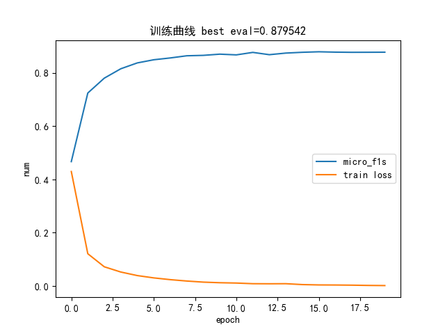
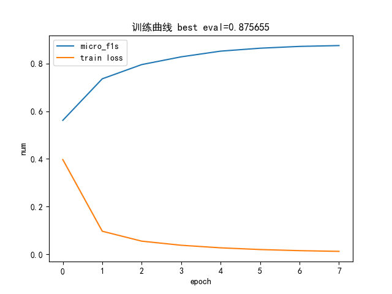

# 基于lstm-crf的实体抽取任务

---

- [X]  基本baseline-数据预处理，模型预测 -21/12/15
- [X]  模型调参优化，生成训练过程以及结果展示文件 -22/1/3

# 一，项目介绍

数据来源：

[2014年人民日报语料](https://github.com/hspuppy/hugbert/blob/master/ner_dataset/pd2014.tar.bz2)

[bert-base-chinese的vocab](https://huggingface.co/bert-base-chinese/blob/main/vocab.txt)

## 1.原理

> 通过lstm做编码，crf做辅助纠正做序列标注，但因为是实体抽取任务，最终统计结果需要通过正则来解码，最后超参数搜索一下超参数

## 2.项目结构

```bash
│  config.py
│  main.py  # 训练脚本
│  README.md
│  requirements.txt
|
├─data
│  │  schema.json  # BIO标注配置文件
│  │  split_dataset.py  # 数据分割
│  │  vocab.txt  # 来自hugging face的词表
│  │
│  ├─test  # 测试集
│  │      source.txt
│  │      target.txt
│  │
│  └─train  # 训练集
│          source.txt
│          target.txt
│
├─output
│  └─model
├─src
│  │  evaluator.py  # 评估函数
│  │  loader.py  # 数据加载
│  │  model.py  # 模型
```

## 3.数据展示
> 最优没用crf的结果：



> 最优用了crf的结果



# 二，使用项目

环境：

```bash
matplotlib==3.2.2
numpy==1.18.5
pytorch_crf==0.7.2
torch==1.8.2+cu111
```

> pip安装crf：pip install pytorch-crf

## 1.下载

`git clone git@github.com:eat-or-eat/dl-ner.git `

## 2.（可选）处理自己的数据成本项目数据格输入式

```
eg：
O:无关词 B:名词首个字 I:名词后面的字
将一下格式的训练集和测试集放到
./data/train/和./data/test/里面
target.txt
这 是 一 个 测 试 \n
...
source.txt
O O O O B I \n
...
```

## 三，运行

`python main.py`

打印示例：

```bash
...
2021-12-15 11:28:14,006 - __main__ - INFO - epoch 20 begin
2021-12-15 11:28:14,034 - __main__ - INFO - batch loss 0.015476
2021-12-15 11:28:15,136 - __main__ - INFO - batch loss 0.014899
2021-12-15 11:28:16,223 - __main__ - INFO - batch loss 0.014573
2021-12-15 11:28:16,223 - __main__ - INFO - epoch average loss: 0.015928
2021-12-15 11:28:16,223 - __main__ - INFO - 测试第20轮模型效果:
2021-12-15 11:28:17,031 - __main__ - INFO - LOC类实体，准确率：0.894329，召回率：0.826009，F1：0.858808
2021-12-15 11:28:17,031 - __main__ - INFO - ORG类实体，准确率：0.890173，召回率：0.639004，F1：0.743956
2021-12-15 11:28:17,031 - __main__ - INFO - PER类实体，准确率：0.823689，召回率：0.706294，F1：0.760483
2021-12-15 11:28:17,031 - __main__ - INFO - T类实体，准确率：0.936535，召回率：0.887651，F1：0.911433
2021-12-15 11:28:17,031 - __main__ - INFO - Macro-F1：0.818670
2021-12-15 11:28:17,032 - __main__ - INFO - Micro-F1 0.844860
2021-12-15 11:28:17,032 - __main__ - INFO - -----------------------------

```
